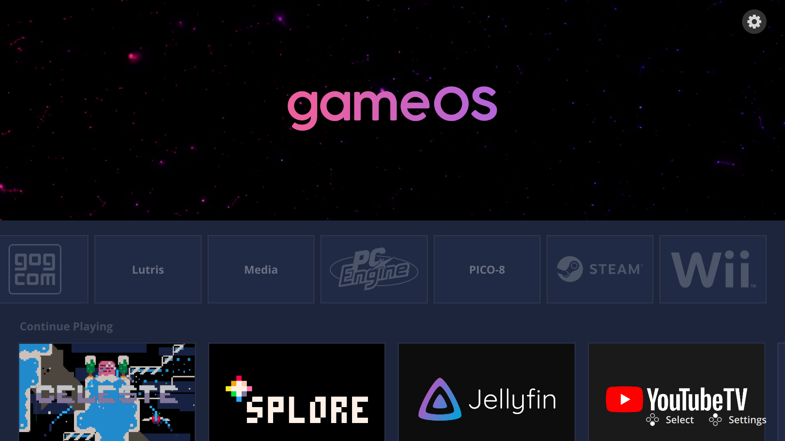
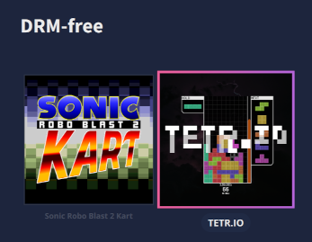
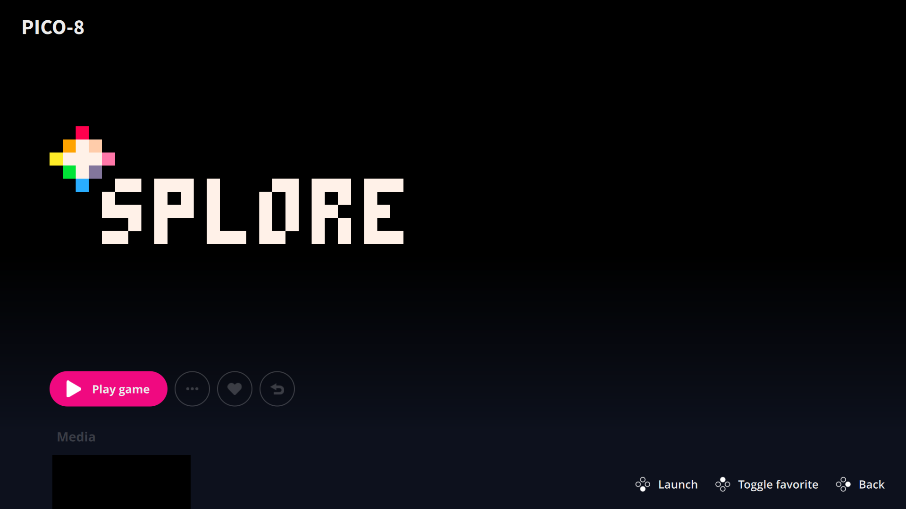

# Pegasus + game console scripts



This folder contains most of the scripts relating to my DIY living room retro console / media PC.

## bspwmrc & setting up autostart

The bspwmrc contained in this folder is designed for a minimal single-purpose install (as described above). Personally, I launch the session with xlogin (``aur/xlogin-git``) and have a specialised ``.xinitrc`` in my home directory:

``` sh
exec bspwm -c $HOME/.config/pegasus-frontend/bspwmrc
```

### Dependencies

(this list might not be fully comprehensive, I've only installed this setup once, so this is just a list of stuff that is directly either mentioned in scripts or installing it resolved a problem that I was having)

FIXME: improve wording

- BSPWM (``community/bspwm``)
- Pegasus Frontend (``aur/pegasus-frontend-git``)
	- GStreamer libav plugin (``gst-libav``)

#### Included shell scripts

These entries will (with these dotfiles) appear in Pegasus no matter if they're installed or not.

- Applications
  - Steam (``multilib/steam``)
    - check Arch wiki for dependencies
  - Terminal (any of the following will work) (list based off of QTile's ``guess_terminal`` function)
    -  kitty (``community/kitty``)
    -  roxterm
    -  sakura
    -  hyper
    -  alacritty
    -  terminator
    -  termite
    -  gnome-terminal
    -  konsole
    -  xfce4-terminal
    -  lxterminal
    -  mate-terminal
    -  yakuake
    -  tilda
    -  guake
    -  eterm
    -  st
    -  urxvt
    -  xterm
    -  x-terminal-emulator
- "DRM-free" (non-emulation games without a launcher or separate category) 
	- Sonic Robo Blast 2 Kart (``aur/srb2kart``)
	- TETR.IO (``aur/tetrio-desktop``)
- Media
	- Jellyfin Media Player (``aur/jellyfin-media-player``)
	- YouTube TV (``aur/youtube-tv-git``)

Special config in ``~/.lexaloffle/pico-8/carts/`` for Splore. 
