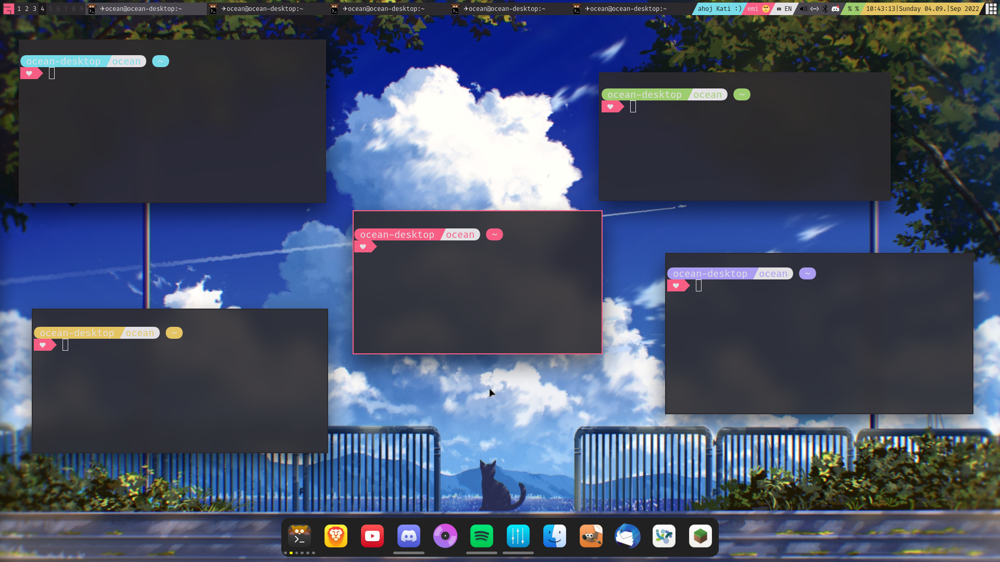

# My dotfiles

These dotfiles are very subjective. They're not made to be user friendly for anyone else besides me and there might be many issues like redundant files etc. This repo is only public so that if you want some inspiration, you might be able to get some here.

My startpage is [start.johnystar.moe](https://start.johnystar.moe/). The source code for it is available [here](https://github.com/Johnystar/startpage).

## Screenshots

### Rice 1

### final

AwesomeWM setup

Tauon Music Box theme
This one got partially broken by an update, but unlike my Discord theming it is still at least working to some degree.

### other

Rofi rice

Qtile, Kitty and ZSH rice
